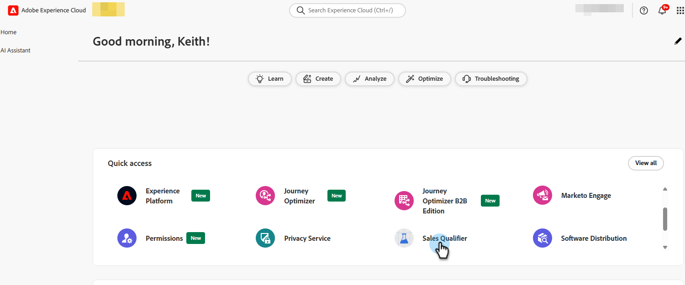
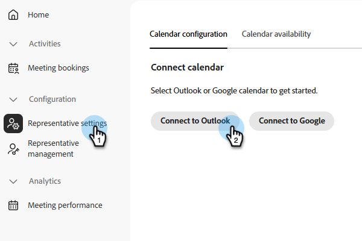
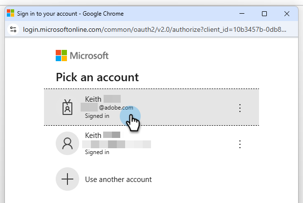
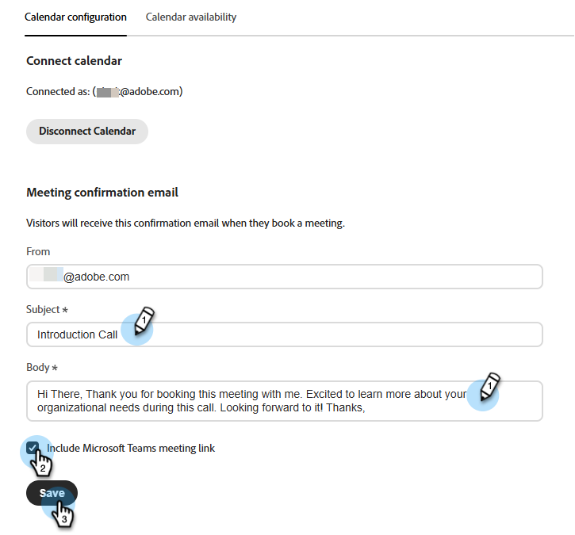
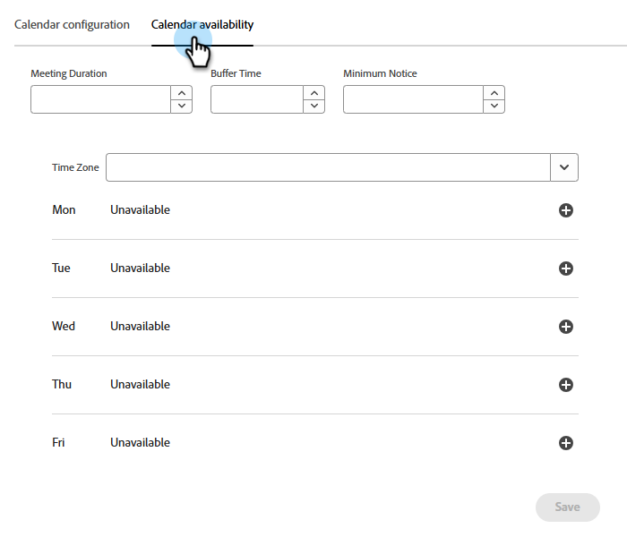
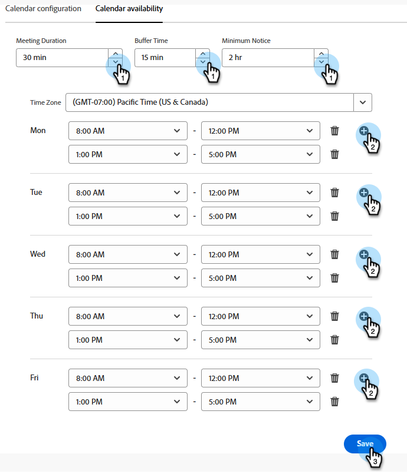
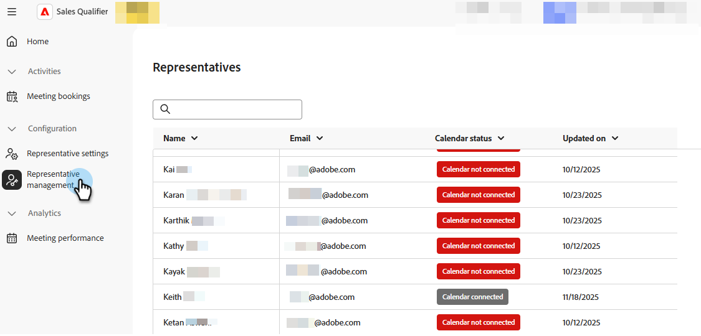
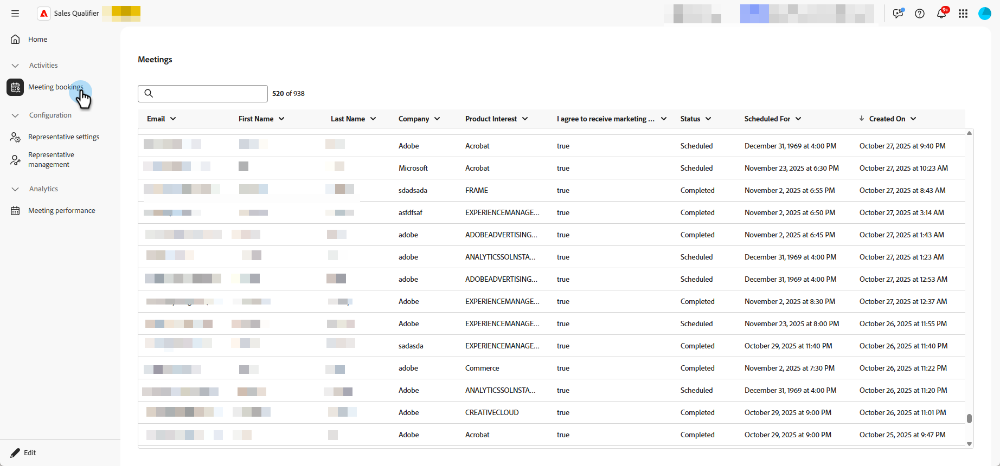
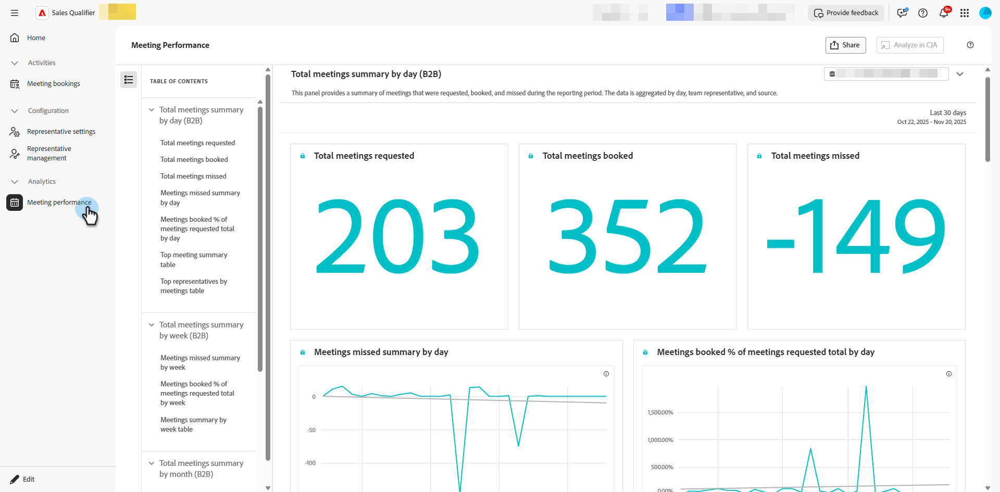

# 會議 {#meetings}

在Adobe Brand Concierge中瞭解所有&#x200B;_會議_&#x200B;設定。 連線您的行事曆、設定可用性、檢視分析等。

相關： [預約會議](../getting-started/meeting-booking.md)影片

## 設定 {#configuration}

連線至您的Outlook或Google帳戶，並決定各種設定，例如一週的某天、時區和會議期間。

### 連線您的行事曆 {#connect}

1. 登入[Adobe Experience Platform](https://experience.adobe.com/){target="_blank"}。

1. 選取&#x200B;**[!UICONTROL 銷售限定詞]**。

   {width="800" zoomable="yes"}

1. 在&#x200B;_組態_&#x200B;下，按一下&#x200B;**[!UICONTROL 代表設定]**。

   

   在&#x200B;_[!UICONTROL 行事曆組態]_&#x200B;索引標籤中，選擇您想要的行事曆。 在此範例中，您正在選取&#x200B;**[!UICONTROL Outlook]**。

1. 選擇已登入的帳戶，或新增帳戶。

   

1. 連線完成後，請指定您需要的電子郵件內容。

   這是收件者與您預約會議時傳送給您的內容。 您也可以包含Microsoft Teams會議連結（選擇性）。

   

1. 按一下&#x200B;**[!UICONTROL 儲存]**。

### 設定日曆可用性 {#availability}

1. 按一下「**[!UICONTROL 行事曆可用性]**」標籤。

   

1. 選擇您想要的設定。

   在此範例中，您選擇30分鐘的&#x200B;**[!UICONTROL 會議持續時間]**，15分鐘的&#x200B;**[!UICONTROL 緩衝時間]**&#x200B;和2小時的&#x200B;**[!UICONTROL 最小通知]**。 可用性設定為星期一到星期五，上午8點至下午5點(PST)，並於中午休息一小時。

   >[!NOTE]
   >
   >若要新增更多時間選項，請按一下加號（）。

   

1. 按一下&#x200B;**[!UICONTROL 儲存]**。

### 代表管理 {#representative}

**僅管理員**。 檢視您的哪些代表已成功連線他們的行事曆。

{width="800" zoomable="yes"}

## 活動 {#activities}

按一下&#x200B;**[!UICONTROL 會議預訂]**&#x200B;以檢閱已預訂的會議、檢視已擷取的資訊、瞭解會議排程的時間等等。

### 會議頁面 {#bookings}

{width="800" zoomable="yes"}

## Analytics {#analytics}

按一下&#x200B;**[!UICONTROL 會議績效]**&#x200B;可檢閱數個不同的分析類別，包括要求會議的訪客數目以及錯過的訪客數目。 您可以看到會議的趨勢、誰是參加會議的代表等等。

### 會議頁面 {#performance}

{width="800" zoomable="yes"}
